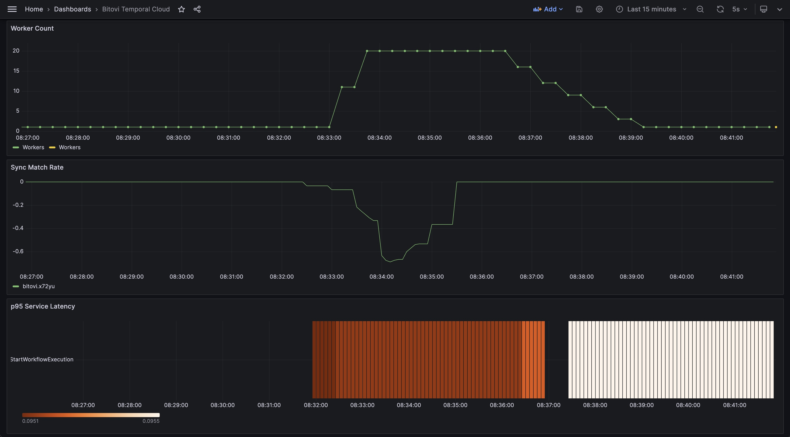

# Temporal Cloud Metrics to Kubernetes

Bring Temporal Cloud Metrics into your Kubernetes cluster to inform autoscaling of your workers.



## Setup

### Prerequisites

1. A [Temporal Cloud account](https://temporal.io/)
    - [An mTLS certificate provisioned](https://docs.temporal.io/cloud/certificates)
    - [The metrics endpoint enabled](https://docs.temporal.io/production-deployment/cloud/metrics/general-setup)
2. A [Kubernetes](https://kubernetes.io/) compliant cluster (also tested on [K3s](https://k3s.io/) and [minikube](https://minikube.sigs.k8s.io/))
3. The [Helm](https://helm.sh/docs/intro/install/) CLI

### Step 1: Copy mTLS Certificate

We need the client mTLS certificate for our Temporal Cloud namespace so that we can load it into our cluster for use in the metrics adapter and worker.

1. Copy the certificate into `./certs/client.crt`
2. Copy the key into `./certs/client.key`

### Step 2: Configuration

A YAML config file is used to define the connection parameters and the specific metrics you'd like to pull into Kubernetes from Temporal Cloud.

There is an example configuration in [`./sample-config.yaml`](./sample-config.yaml). Copy it to `config.yaml` and and make your changes to it. The Helm chart will use this path by default.

__Considerations__

Autoscaling in Kubernetes is triggered when a target metric value increases beyond a designated threshold, such as CPU usage, memory usage, or request count. Therefore, it is important that the metrics we calculate are positive numbers that increase when the system is under some kind of stress.

The queries in the included example configuration were derived from queries associated with Temporal best practices, but they have been modified to align with these requirements. Let's see an example.

__Before__

```
sum by(temporal_namespace) (
  rate(
    temporal_cloud_v0_poll_success_sync_count{}[1m]
  )
)
-
sum by(temporal_namespace) (
  rate(
    temporal_cloud_v0_poll_success_count{}[1m]
  )
)
```

__After__

We've made two important changes here: (1) we've swapped the places of the two underlying metrics to invert the resulting number so it will now be positive and increase as the Sync Match Rate falls, (2) use clamp_min to set a lower bound of zero, and (3) we default the resulting value to zero in the event no data points are available within the specified time window.

```
sum(
  clamp_min(
    (
      sum by(temporal_namespace) (
        rate(
          temporal_cloud_v0_poll_success_count{}[1m]
        )
      )
      -
      sum by(temporal_namespace) (
          rate(
              temporal_cloud_v0_poll_success_sync_count{}[1m]
          )
      )
    ),
    0
  )
) or vector(0)
```

### Step 3: HPA

The HPA (Horizontal Pod Autoscaler) defines the desired scaling behavior and bounds, and manages our deployment replicas accordingly.

There is a complete example HPA in [`./chart/templates/hpa.yaml`](./chart/templates/hpa.yaml). You may use it as it or adjust it to fit your needs before installing the helm chart.

### Step 4: Install

__Install with Existing worker__

This allows you to setup autoscaling on an existing deployment.

```bash
helm install temporal-cloud-metrics-adapter ./chart --wait \
  --namespace staging \
  --set-file=temporal.tls.cert=certs/client.crt \
  --set-file=temporal.tls.key=certs/client.key \
  --set-file=adapter.config=config.yaml \
  --set temporal.namespace=xyz.123 \
  --set worker.deployment=temporal-workers
```

__Install with Demo worker__

This is intended for testing and demos and should never been used in a production environment.

```bash
helm install temporal-cloud-metrics-adapter ./chart --wait \
  --namespace staging --create-namespace \
  --set-file=temporal.tls.cert=certs/client.crt \
  --set-file=temporal.tls.key=certs/client.key \
  --set-file=adapter.config=config.yaml \
  --set temporal.namespace=xyz.123 \
  --set temporal.address=xyz.123.tmprl.cloud:7233 \
  --set worker.demo=true
```

__Uninstall__

```bash
helm uninstall -n staging temporal-cloud-metrics-adapter
```

__Helm Values__

| Option                    | Type    | Example Value                        | Description                                         |
|---------------------------|---------|--------------------------------------|-----------------------------------------------------|
| temporal.tls.cert         | File    | `certs/client.crt`                   | Path to the client certificate file                 |
| temporal.tls.key          | File    | `certs/client.key`                   | Path to the client key file                         |
| temporal.namespace        | String  | `xyz.123`                            | The target Temporal Cloud namespace                 |
| temporal.address          | String  | `xyz.123.tmprl.cloud:7233`           | Address of the Temporal Cloud instance              |
| adapter.config            | String  | `./config.yaml`                      | The file path for the configuration for the adapter |
| worker.deployment         | String  | `temporal-worker`                    | Name of existing Temporal worker deployment         |
| worker.demo               | Boolean | `true` or `false`                    | Flag to determine whether to deploy a demo worker   |

### Demo

This repo includes a script to create a burst of workflows to simulate load.

```bash
# Startup 50 demo workflows
TEMPORAL_ADDRESS=xyz.123.tmprl.cloud:7233 \
TEMPORAL_NAMESPACE=xyz.123 \
./scripts/execute-demo-workflows 50
```

## Metric Granularity

Temporal Cloud metrics do not include labels that indicate which Workflow they are associated with. Depending on your architecture, you might need to divide your workers across unique namespaces to obtain metrics for specific Workflows.

## Tuning Scaling Behavior

__HPA Polling Interval__

By default, the `HorizontalPodAutoscaler` fetches metrics every 15 seconds. This can be configured by setting the `--horizontal-pod-autoscaler-sync-period` on the [kube controller](https://kubernetes.io/docs/reference/command-line-tools-reference/kube-controller-manager/).

_Note: The `--horizontal-pod-autoscaler-sync-period` is not currently supported in K3s._

__Adjust Metrics Time Window__

You can also adjust the timescale used in the query for the Temporal Cloud metrics. To do this, change the time window specified in the queries in the [adapter configuration file](./chart/templates/configuration.yaml).

Currently, the time window is set to `1m` (1 minute). This can be reduced to slightly improve the responsiveness of the scaling behavior. Be cautious about going below `45s` (45 seconds) for systems with relatively low throughput, as it can result in dead zones in the resulting metrics.

__Adjust HPA Behavior__

You can adjust the how quickly the cluster scales up and down our workers.

```yaml
  metrics:
  - type: External
    external:
      metric:
        # The name of the metrics to watch
        name: temporal_cloud_sync_match_rate
        selector:
          matchLabels:
            # Match a particular Temporal Cloud namespace
            temporal_namespace: xyz.123
      target:
        type: Value
        # Scale up when the target metric exceeds 50 milli values (0.05)
        value: 50m
  behavior:
    scaleUp:
      # The highest value in the last 10 seconds will be used to determine the need to scale up
      stabilizationWindowSeconds: 10
      selectPolicy: Max
      policies:
        # Scale up by 5 pods every 10 seconds whole the target threshold is exceeded
        - type: Pods
          value: 5
          periodSeconds: 10
    scaleDown:
      # The highest value in the last 60 seconds will be used to determine the need to scale down
      stabilizationWindowSeconds: 60
      selectPolicy: Max
      policies:
        # Scale up by 5 pods every 10 seconds whole the target threshold is achieved
        - type: Pods
          value: 3
          periodSeconds: 30
```

You can find a complete example in this [manifest](./chart/templates/hpa.yaml). For more detailed information on the HorizontalPodAutoscaler, refer to the official [HPA documentation](https://kubernetes.io/docs/tasks/run-application/horizontal-pod-autoscale/).

## Scaling to Zero

In some use cases, you might want your application to scale completely down to zero. This can be achieved by configuring the [`HorizontalPodAutoscaler`](./chart/templates/hpa.yaml).

To scale to zero, set `minReplicas` to `0`. The cluster will then scale down to zero when the targeted metrics fall below the defined threshold.

_Note: Scaling to zero may cause a delay in processing new tasks, as it can take time for metrics to propagate to the cluster._